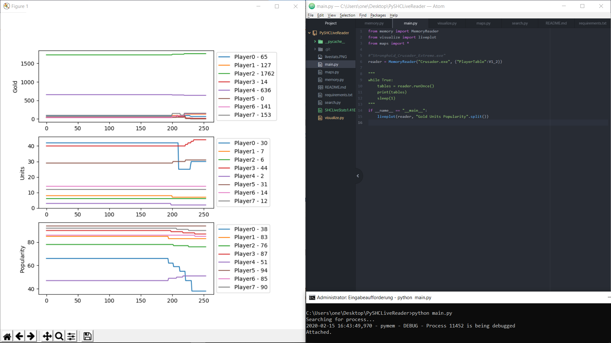

# PySHCLiveReader

Provides and optionally graphs live game statistics, ideal for tournaments!

## Installation
`pip install -r requirements.txt`

Note: --user

## Usage
Open a `cmd` with Administrator privileges

The MemoryReader has two arguments. First, the name of the process. Which is typically either

- "Crusader.exe"
- "Stronghold_Crusader.exe"
- "Stronghold_Crusader_Extreme.exe"

The second argument is a dictionary of tables. Each table supplies the MemoryReader with the addresses it tracks. The tables are stored in `tables.py`. Different Stronghold versions need different tables. Currently (partially) supported:

- V1_2 (Stronghold Crusader Version 1.2)
- V1_2_1_E (Stronghold Crusader Extreme Version 1.2.1)
- V1_41E_UCP2_13 (V1.41 Extreme with [UnofficalCrusaderPatch 2.13](https://github.com/Sh0wdown/UnofficialCrusaderPatch))

`reader = MemoryReader("Crusader.exe", {"PlayerTable": V1_2})`

### Live plotting

`python main.py`

### Using the library for your own data visualizations

See [`example.py`](example.py)

## Manual config - Adding yet unsupported versions/memory addresses

If you are using a different Stronghold version or want to extend support for new fields, use [CheatEngine](https://cheatengine.org/) or the here included `search.py` to search for the memory addresses, then update the corresponding table in `tables.py`.

The header row indicates the name of all cells in its column, their size in bytes and their type (i=integer, s=string). There is one line for each player.

## Closing notes

This library is written very generally, it can be easily reused for other programs and games. The address table format makes it especially suited for those with several players.
